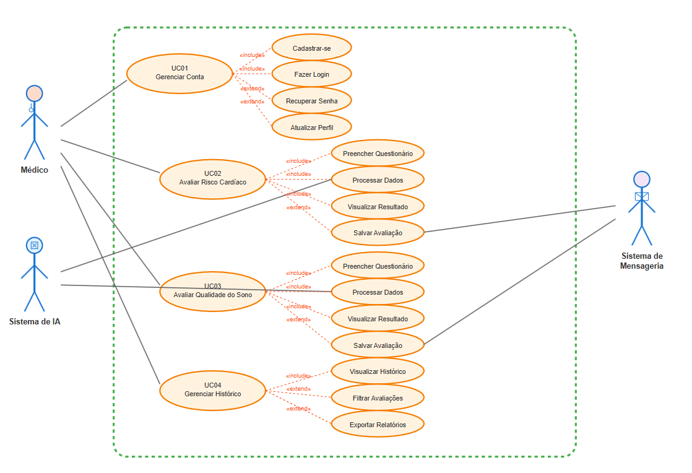

# Projeto HealthCheck: Aplicação Mobile para Verificação de Risco de Doença Cardíaca e Qualidade do Sono

## Memorial Descritivo do Projeto

## Visão Geral
O HealthCheck evolui para uma plataforma abrangente de saúde que combina duas funcionalidades principais: avaliação de risco cardíaco e análise da qualidade do sono. A aplicação mobile para dispositivos Android utiliza inteligência artificial para processar dados fornecidos pelo usuário em ambos os módulos, oferecendo insights valiosos sobre a saúde cardiovascular e padrões de sono.

O módulo cardíaco mantém sua funcionalidade original, coletando informações como sintomas, resultados de exames, frequência cardíaca, idade e sexo. O novo módulo de sono analisa dados como duração do sono, qualidade percebida, nível de atividade física, estresse, IMC e outros fatores relacionados ao bem-estar geral.

## Arquitetura do Sistema
O sistema é composto por cinco componentes principais:

**Aplicação Mobile**: Desenvolvida em C# utilizando o framework .NET MAUI para garantir uma interface responsiva e intuitiva para dispositivos Android, agora com duas seções principais: Cardíaco e Sono.

**Aplicação Web (Frontend)**: Desenvolvida em React com JavaScript/TypeScript, aproveitando o ecossistema de componentes reutilizáveis e o gerenciamento eficiente de estado para garantir uma interface responsiva e intuitiva que funciona perfeitamente em diferentes navegadores e dispositivos, agora com duas seções principais: Cardíaco e Sono.

**API Gateway**: Implementada em Node.js com Express, responsável por gerenciar as requisições do aplicativo, roteamento entre módulos, autenticação de usuários e orquestração das comunicações.

**Processos Especializados**:
- **Serviço Cardíaco**: Mantém a funcionalidade original de avaliação de risco cardíaco
- **Serviço de Sono**: Novo serviço dedicado à análise da qualidade do sono

**Servidor**: Hospedado na Azure em VMs Ubuntu Server com balanceamento de carga, garantindo escalabilidade, segurança e alta disponibilidade para ambos os módulos.

**Modelos de IA Especializados**: 
- **Modelo Cardíaco**: Algoritmo existente para classificação de risco cardíaco
- **Modelo de Sono**: Novo modelo desenvolvido em Python para análise de qualidade do sono e identificação de distúrbios

## Fluxo de Dados

### Módulo Cardíaco
1. O médico se cadastra e faz login no aplicativo
2. O médico acessa o módulo cardíaco
3. O médico preenche o questionário com dados de saúde cardíaca do paciente
4. Os dados são enviados para a API Gateway
5. A API encaminha para o Serviço Cardíaco
6. O modelo cardíaco processa os dados e retorna classificação (0 - Normal, 1 - Risco)
7. O resultado é armazenado e exibido com recomendações

### Módulo de Sono
1. O médico acessa o módulo de sono
2. O médico preenche o questionário de qualidade do sono
3. Os dados são enviados para a API Gateway
4. A API encaminha para o Serviço de Sono
5. O modelo de sono processa os dados e retorna análise de qualidade
6. O resultado é armazenado e exibido com recomendações específicas

## Modelagem Inicial

### Diagramas de Caso de Uso

#### Atores
- **Médico:** Usuário principal que realiza avaliações
- **Sistema de IA:** Processa dados e gera classificações
- **Sistema de Mensageria:** Gerencia comunicação assíncrona

#### Casos de Uso Principais

**UC01 - Gerenciar Conta**
- Cadastrar-se no sistema
- Fazer login
- Recuperar senha
- Atualizar perfil

**UC02 - Avaliar Risco Cardíaco**
- Preencher questionário cardíaco
- Processar dados cardíacos
- Visualizar resultado cardíaco
- Salvar avaliação cardíaca

**UC03 - Avaliar Qualidade do Sono**
- Preencher questionário de sono
- Processar dados de sono
- Visualizar resultado de sono
- Salvar avaliação de sono

**UC04 - Gerenciar Histórico**
- Visualizar histórico de avaliações
- Filtrar por tipo de avaliação
- Exportar relatórios



## Análise de Requisitos

### 1. Requisitos Funcionais

### Módulo Cardíaco (RF01 a RF06)

**RF01 - Cadastro do Médico**
- O sistema deve permitir o cadastro de novos médicos coletando: Nome, Idade, Sexo, Email, Senha, Endereço, Telefone e CPF
- O sistema deve validar a unicidade do CPF e email
- O sistema deve criptografar a senha do usuário antes de armazená-la

**RF02 - Autenticação de Usuário**
- O sistema deve permitir login utilizando CPF ou Email e Senha
- O sistema deve emitir e validar tokens JWT para manter a sessão do usuário
- O sistema deve permitir a recuperação de senha via email

**RF03 - Questionário de Saúde**
- O sistema deve apresentar um questionário com 9 perguntas relacionadas a fatores de risco para doenças cardíacas
- O sistema deve coletar e validar os seguintes dados:
   - Tipo de dor no peito (numérico)
   - Pressão arterial em repouso (numérico)
   - Colesterol sérico em mg/dl (numérico)
   - Glicemia de jejum > 120 mg/dl (booleano)
   - Resultados de eletrocardiograma em repouso (categórico)
   - Frequência cardíaca máxima atingida (numérico)
   - Angina induzida por exercício (booleano)
   - Depressão do segmento ST induzida por exercício (numérico)
   - Inclinação do segmento ST de pico do exercício (categórico)

**RF04 - Processamento e Classificação**
- O sistema deve enviar os dados coletados para processamento pelo modelo de IA
- O sistema deve classificar o risco de doença cardíaca (0 - Normal, 1 - Risco de doença)

**RF05 - Visualização de Resultados**
- O sistema deve exibir o resultado da classificação de forma clara e compreensível
- O sistema deve apresentar recomendações médicas baseadas no resultado, indicando a necessidade de procurar um especialista (cardiologista)

**RF06 - Histórico de Avaliações**
- O sistema deve armazenar o histórico de todas as avaliações realizadas
- O sistema deve permitir a visualização do histórico 

### Módulo de Sono

**RF07 - Questionário de Qualidade do Sono**
- O sistema deve apresentar um questionário específico para avaliação do sono
- O sistema deve coletar e validar os seguintes dados:
  - ID da pessoa (numérico)
  - Gênero (categórico: Male/Female)
  - Idade (numérico: 27-59 anos)
  - Ocupação (categórico: múltiplas profissões)
  - Duração do sono em horas (numérico: 5.8-8.5)
  - Qualidade do sono (escala 1-10)
  - Nível de atividade física (numérico: 30-90)
  - Nível de estresse (escala 3-8)
  - Categoria de IMC (categórico: Normal, Overweight, Obese)
  - Pressão arterial (formato: sistólica/diastólica)
  - Frequência cardíaca (numérico: 65-86 bpm)
  - Passos diários (numérico: 3000-10000)
  - Distúrbio do sono (categórico: None, Sleep Apnea, Insomnia)

**RF08 - Processamento e Análise de Sono**
- O sistema deve enviar os dados coletados para o modelo de IA de sono
- O sistema deve classificar a qualidade do sono e identificar possíveis distúrbios
- O sistema deve gerar score de qualidade do sono

**RF09 - Visualização de Resultados de Sono**
- O sistema deve exibir análise detalhada da qualidade do sono
- O sistema deve apresentar recomendações para melhoria do sono
- O sistema deve alertar sobre possíveis distúrbios identificados

**RF10 - Dashboard Integrado**
- O sistema deve apresentar um dashboard com visão consolidada de ambos os módulos
- O sistema deve permitir navegação entre módulos cardíaco e sono
- O sistema deve manter histórico separado para cada módulo

### 2. Requisitos Não Funcionais

**RNF01 - Desempenho**
- O tempo de resposta para processamento do questionário não deve exceder 30 segundos
- A aplicação deve suportar até 1000 usuários simultâneos
- O sistema deve processar até 10.000 avaliações por dia

**RNF02 - Segurança**
- Todos os dados pessoais e médicos devem ser criptografados em trânsito e em repouso
- O sistema deve estar em conformidade com a LGPD (Lei Geral de Proteção de Dados)
- O sistema deve realizar backups diários dos dados

**RNF03 - Usabilidade**
- A interface deve ser intuitiva e acessível para usuários de todas as idades
- O sistema deve fornecer feedback claro sobre erros e ações realizadas

**RNF04 - Escalabilidade**
- A arquitetura deve permitir escalar horizontalmente para atender ao aumento de demanda
- O banco de dados deve suportar crescimento de até 1GB por ano

**RNF05 - Compatibilidade**
- O aplicativo deve ser compatível com Android 8.0 (Oreo) ou superior
- A interface deve se adaptar a diferentes tamanhos de tela

## Validações Técnicas do Módulo Cardíaco

**Tipo de Dor no Peito:**
- **Validação:** Apenas valores 1, 2, 3 ou 4 são aceitos
- **Obrigatório:** Sim

**Pressão Arterial em Repouso:**
- **Validação:** Valor numérico entre 90 e 200 mm Hg
- Alerta se < 90 ou > 180 mm Hg
- **Obrigatório:** Sim

**Colesterol Sérico:**
- **Validação:** Valor numérico entre 100 e 600 mg/dl
- Alerta se < 130 ou > 240 mg/dl
- **Obrigatório:** Sim

**Glicemia de Jejum:**
- **Validação:** Apenas valores 0 ou 1 são aceitos
- **Obrigatório:** Sim

**Resultados de Eletrocardiograma em Repouso:**
- **Validação:** Apenas valores 0, 1 ou 2 são aceitos
- **Obrigatório:** Sim

**Frequência Cardíaca Máxima Atingida:**
- **Validação:** Valor numérico entre 71 e 202 bpm
- Alerta se valor for inconsistente com a idade (220 - idade)
- **Obrigatório:** Sim

**Angina Induzida por Exercício:**
- **Validação:** Apenas valores 0 ou 1 são aceitos
- **Obrigatório:** Sim

**Depressão do Segmento ST:**
- **Validação:** Valor numérico entre 0 e 6.2
- **Obrigatório:** Sim

**Inclinação do Segmento ST:**
- **Validação:** Apenas valores 0, 1 ou 2 são aceitos
- **Obrigatório:** Sim

## Validações Técnicas do Módulo de Sono

**Duração do Sono:**
- Validação: Valor numérico entre 5.8 e 8.5 horas
- Alerta se < 6 ou > 8 horas
- Obrigatório: Sim

**Qualidade do Sono:**
- Validação: Escala de 1 a 10
- Obrigatório: Sim

**Nível de Atividade Física:**
- Validação: Valor numérico entre 30 e 90 minutos
- Obrigatório: Sim

**Nível de Estresse:**
- Validação: Escala de 3 a 8
- Obrigatório: Sim

**Categoria de IMC:**
- Validação: Apenas valores "Normal", "Normal Weight", "Overweight", "Obese"
- Obrigatório: Sim

**Pressão Arterial:**
- Validação: Formato "sistólica/diastólica" (ex: 120/80)
- Validação: Sistólica entre 90-200, Diastólica entre 60-120
- Obrigatório: Sim

**Frequência Cardíaca:**
- Validação: Valor numérico entre 65 e 86 bpm
- Obrigatório: Sim

**Passos Diários:**
- Validação: Valor numérico entre 3000 e 10000
- Obrigatório: Sim

## Regras de Negócio

### Módulo Cardíaco (RN01 a RN06)

**RN01 - Cadastro e Acesso**
- Apenas usuários médicos podem se cadastrar no sistema
- Um CPF só pode estar associado a uma única conta
- Um email só pode estar associado a uma única conta

**RN02 - Avaliação de Risco**
- O modelo de IA deve ser treinado com o dataset do Kaggle especificado
- A precisão mínima aceitável do modelo de classificação é de 85%

**RN03 - Recomendações Médicas**
- Usuários classificados com risco de doença cardíaca devem receber recomendação para consultar um cardiologista em até 30 dias
- Usuários classificados como normais devem receber recomendações preventivas

**RN04 - Privacidade e Ética**
- Os dados dos usuários não podem ser compartilhados com terceiros sem consentimento explícito
- O sistema deve apresentar termos de uso e política de privacidade claros

**RN05 - Limitações e Avisos**
- O sistema deve exibir claramente que não substitui diagnóstico médico profissional
- Resultados críticos devem ser acompanhados de avisos sobre a urgência de buscar atendimento médico

**RN06 - Anexos**
- O sistema deve permitir que o usuário anexe resultados de exames (opcional) para referência futura

### Módulo de Sono

**RN07 - Avaliação de Qualidade do Sono**
- O modelo de sono deve ser treinado com dataset específico de qualidade do sono
- A precisão mínima aceitável do modelo é de 80%
- Identificação de padrões de distúrbios do sono (Sleep Apnea, Insomnia)

**RN08 - Recomendações de Sono**
- Usuários com qualidade de sono baixa (< 5) devem receber recomendações específicas
- Usuários com possíveis distúrbios devem ser orientados a procurar especialista em medicina do sono
- Recomendações devem incluir higiene do sono e mudanças de estilo de vida

**RN09 - Integração de Módulos**
- Os módulos devem funcionar independentemente
- Dados de um módulo não devem influenciar diretamente o outro
- Históricos devem ser mantidos separadamente

**RN10 - Privacidade**
- Dados de sono são considerados sensíveis e devem ter proteção adicional
- Usuário deve consentir especificamente para cada módulo utilizado

## Justificativa

As doenças cardiovasculares continuam sendo a principal causa de morte no mundo, e os distúrbios do sono afetam aproximadamente 30% da população adulta, segundo estudos recentes. A qualidade do sono inadequada está associada a diversos problemas de saúde, incluindo obesidade, diabetes, depressão e redução da qualidade de vida.

O HealthCheck expandido visa oferecer uma abordagem mais holística da saúde, permitindo que profissionais médicos avaliem dois aspectos fundamentais do bem-estar de seus pacientes. A análise da qualidade do sono complementa a avaliação cardíaca, fornecendo um panorama mais completo da saúde do indivíduo.

A escolha das tecnologias permite o desenvolvimento de uma solução robusta, escalável e segura, capaz de processar dados sensíveis de saúde com a devida proteção e confiabilidade. O uso de inteligência artificial possibilita a análise de múltiplos fatores de risco simultaneamente, oferecendo uma avaliação mais abrangente do que métodos tradicionais de triagem.

## Diagrama de Classes do Banco de Dados


## BPMN

### 1. Processo Principal


### 2. Subprocesso: Cadastro de Usuário


### 3. Subprocesso: Preenchimento do Questionário


### 4. Subprocesso: Análise pelo Modelo de IA


## Detalhamento das Telas

### Tela Principal/Dashboard
- Navegação entre módulos Cardíaco e Sono
- Resumo de avaliações recentes de ambos os módulos
- Acesso rápido a nova avaliação
- Indicadores visuais de status de saúde

### Tela de Cadastro
- Campos para entrada de dados pessoais (Nome, CRM, Email, Senha, Especialidade)
- Validação em tempo real dos campos
- Botão para enviar cadastro
- Link para tela de login (caso já tenha conta)

### Tela de Login
- Campo para CPF ou Email
- Campo para Senha
- Opção "Lembrar-me"
- Link para recuperação de senha
- Botão para entrar
- Link para tela de cadastro

### Tela de Questionário
- Formulário com 9 perguntas sobre fatores de risco cardíaco
- Campos adequados para cada tipo de dado (numérico, booleano, categórico)
- Explicações sobre cada pergunta
- Botão para enviar respostas
- Botão para limpar formulário

### Tela de Resultados
- Indicação visual clara do resultado (0 - Normal, 1 - Risco de doença)
- Explicação detalhada do significado do resultado
- Indicação para procurar especialista (cardiologista, quando necessário)
- Botão para salvar ou compartilhar resultado
- Botão para realizar nova avaliação

### Tela de Questionário de Sono
- Formulário específico com campos de qualidade do sono
- Campos adequados para cada tipo de dado (sliders, dropdowns, inputs numéricos)
- Explicações sobre cada pergunta relacionada ao sono
- Validação em tempo real
- Botão para enviar respostas

### Tela de Resultados de Sono
- Score de qualidade do sono com indicação visual
- Análise detalhada dos padrões de sono
- Identificação de possíveis distúrbios
- Recomendações específicas para melhoria do sono
- Opção para agendar consulta com especialista em sono

### Tela de Histórico
- Lista de cards mostrando avaliações anteriores
- Cada card contém data e resultado (positivo/negativo)
- Opção para filtrar por período
- Opção para ordenar por data
- Gráfico de tendência (opcional)

### Tela de Histórico Expandida
- Abas separadas para histórico cardíaco e sono
- Filtros por módulo, período e tipo de resultado
- Gráficos de tendência para ambos os módulos
- Comparação de resultados ao longo do tempo

## Computação em Nuvem II

### Definição dos Serviços em Nuvem

#### Utilização de Mensageria para o processamento das avaliações
**Justificativa:**
- **Processamento Assíncrono:** Permite que avaliações sejam processadas em background, melhorando a experiência do usuário
- **Escalabilidade:** Suporta picos de demanda sem perda de dados
- **Confiabilidade:** Garante entrega de mensagens mesmo em caso de falhas temporárias
- **Desacoplamento:** Separa a interface do usuário do processamento de IA

### Arquitetura de Mensageria

```
Mobile App / Web App → API Gateway → Service Bus → AI Processing → Database
     ↑                                                 ↓
     └────────────── Notification Queue ←──────────────┘
```

**Fluxo de Mensagens:**
1. **Envio:** API recebe dados e envia para fila apropriada
2. **Processamento:** Worker processa mensagem da fila
3. **Resultado:** Worker salva resultado no banco
4. **Notificação:** Worker envia notificação de conclusão
5. **Resposta:** App consulta resultado via API

### Arquitetura do Sistema

```
┌─────────────────┐    ┌─────────────────┐    ┌─────────────────┐
│ Mobile/Web App  │    │   API Gateway   │    │  Message Queue  │
│   (.NET MAUI)   │◄──►│   (Node.js)     │◄──►│                 │
└─────────────────┘    └─────────────────┘    └─────────────────┘
                                │                        │
                                ▼                        ▼
                       ┌─────────────────┐    ┌─────────────────┐
                       │   Database      │    │  AI Processing  │
                       │  (PostgreSQL)   │    │   (Python)      │
                       └─────────────────┘    └─────────────────┘
```


## Mineração de Dados

### Definição da Base de Dados

### Dataset de Sono (Sleep_health_and_lifestyle_dataset.csv)
**Características Identificadas:**
- **Registros:** 374 amostras
- **Atributos:** 13 variáveis
- **Variáveis Principais:**
  - `person_id`: Identificador único
  - `gender`: Gênero (Male/Female)
  - `age`: Idade (27-59 anos)
  - `occupation`: Ocupação profissional
  - `sleep_duration`: Duração do sono (5.8-8.5 horas)
  - `quality_of_sleep`: Qualidade do sono (4-9 escala)
  - `physical_activity_level`: Nível de atividade física (30-90 min)
  - `stress_level`: Nível de estresse (3-8 escala)
  - `bmi_category`: Categoria IMC (Normal, Overweight, Obese)
  - `blood_pressure`: Pressão arterial (formato sistólica/diastólica)
  - `heart_rate`: Frequência cardíaca (65-86 bpm)
  - `daily_steps`: Passos diários (3000-10000)
  - `sleep_disorder`: Distúrbio do sono (None (sem disturbio), Sleep Apnea, Insomnia)

### Planejamento das Técnicas de Mineração

**Fase 1: Pré-processamento**
 - Limpeza de Dados: Tratamento de valores ausentes;Normalização de formatos;Detecção e tratamento de outliers
 - Transformação de Dados: Normalização de variáveis numéricas


**Fase 2: Classificação (Técnica Principal)**
 - Detecção de Distúrbios do Sono: 
    - Variável Target: sleep_disorder
    - Classes: None, Insomnia, Sleep Apnea
    - Algoritmos a testar:
        - Decision Trees
        - Random Forest
        - XGBoost
        - Ensemble Methods


**Fase 3: Validação e Métricas**
  - Métricas de Avaliação:
      - Accuracy
      - Precision, Recall, F1-Score
      - Confusion Matrix
      - ROC-AUC (para problemas binários)

  - Validação:
    - Cross-validation (k-fold)
    - Holdout validation (70/30 split)
